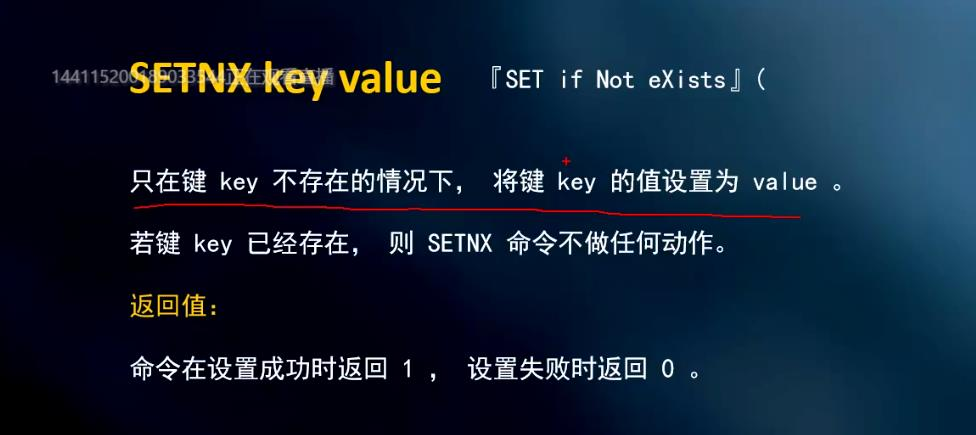

## 基本流程
1.第一次查询 redis中没缓存数据，到数据库中查询，获取到数据后，在放入redis中
2.对列表数据进行修改，清除redis中相应列表，等下次查询数据后更新缓存中数据

## 列表数据缓存方案

启动时 就先查询数据库 放入redis中
修改数据时 对相应列表移除 下次查询时再从数据库中 放到redis

## 缓存穿透
获取数据时没有从缓存中获取数据，直接到数据库获取数据
访问实际没有的数据，空数据，解决方案 将空值也缓存起来，并设置过期时间

## 缓存雪崩
高并发的情况下，假如数据刚好过期，高并发访问，解决方案：双重校验锁
搭建高可用集群：redis 集群 哨兵模式
预加载数据，启动时加载肯能会被高访问的数据，将其放入缓存中

## 数据类型
String（字符串） Hash（哈希 类似于map k-v） Set（集合） Zset（有序集合） List（列表）

## 分布式锁

``` java
redisTemplate.opsForValue.setIfAbsent(k,v) 返回一个boolean
```
这种方式会产生死锁
例如：如果出现异常后面代码没有执行，没有delete就会死锁，try catch finally 貌似可以解决，但是宕机情况也会死锁
所以使用超时时间过期的方式

需要实现一个阻塞锁，尝试一直去拿锁，自旋锁
不可重入，及多次拿到锁之后，会得到false
解决方案是 计数的方式，加锁+1，解锁-1，当值为0的时候再delete
过期时间不足以执行完代码也会释放锁，导致锁失效，注意设置好过期时间
可以采取 异步的设置过期时间 异步续命的方式
## 一个分布式锁，满足以下需求

### redisson框架可解决分布式锁