## mysql 常用存储引擎
* MyIASM（5.5以前默认） innodb（5.5之后默认）
* MyISAM 不支持外键，不支持事务，表锁定，缓存只缓存索引，相较性能高
* innodb 支持外键，支持事务，行锁定，缓存索引还缓存真实数据（内存要求较高），相较性能低

## 索引
一种是hash索引和B+tree索引，使用的是innodb引擎，默认B+tree

### hash索引
* 底层使用的哈希表，哈希表是一种k-v存储数据的结构；
* 所以多个数据在存储关系上是完全没有顺序关系的；
* 所以在区间查询是无法直接通过索引查询的，就需要全表扫描；
* 所以hash索引更适用于等值查询的场景

### B+tree索引
多路平衡查询树，它的节点是天然有序的，左节点小于父节点，父节点小于右节点，所以范围查询的时候不需要全表扫描

### hash和B+tree索引两者区别
哈希索引更适用于等值查询，但是无法范围查询，原因是无法使用hash索引进行排序，hash索引不支持多列联合索引的最左匹配规则，如果有大量重复键值的情况下，hash索引的效率会很低，因为存在hash碰撞问题

### 聚簇索引和非聚簇索引
* 在 InnoDB 里，索引B+ Tree的叶子节点存储了整行数据的是主键索引，也被称之为聚簇索引。
* 而索引B+ Tree的叶子节点存储了主键的值的是非主键索引，也被称之为非聚簇索引。
* 聚簇索引更快，因为主键索引树的叶子节点直接就是我们要查询的整行数据了。
* 而非主键索引的叶子节点是主键的值，查到主键的值以后，还需要再通过主键的值再进行一次查询。

### 联合索引和最左前缀匹配
* 对多个字段添加索引，就是联合索引
* where子句中使用最频繁的一列放在最左边，因为MySQL索引查询会遵循最左前缀匹配的原则，
* 即最左优先，在检索数据时从联合索引的最左边开始匹配。
* 所以当我们创建一个联合索引的时候，如(key1,key2,key3)，
* 相当于创建了（key1）、(key1,key2)和(key1,key2,key3)三个索引，这就是最左匹配原则。

## 数据结构
二叉树，红黑树，BTree，B+Tree， Hash(哈希)

### 二叉树
左小右大，如果顺序递增id，会产生线性结构

### 红黑树
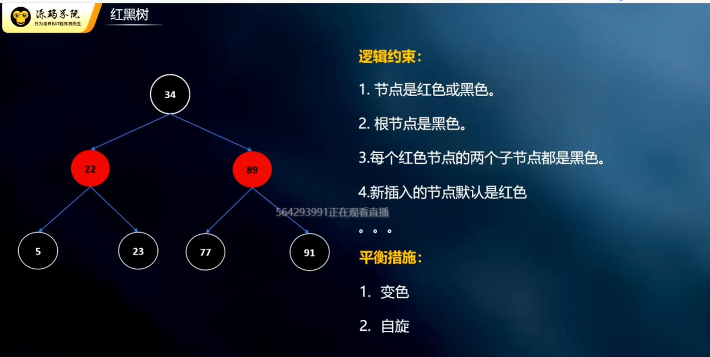

### BTree
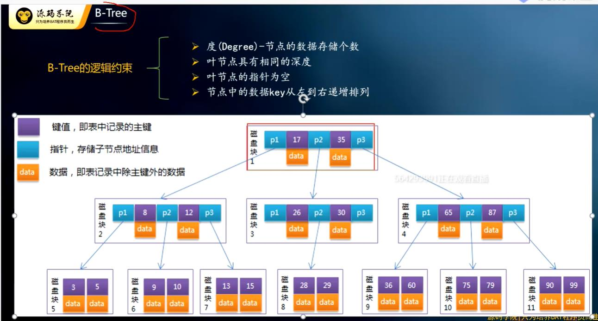

### B+Tree


### hash(哈希)
存在碰撞，不支持范围查询（因为hash算法之后不能保证 hash值有序）
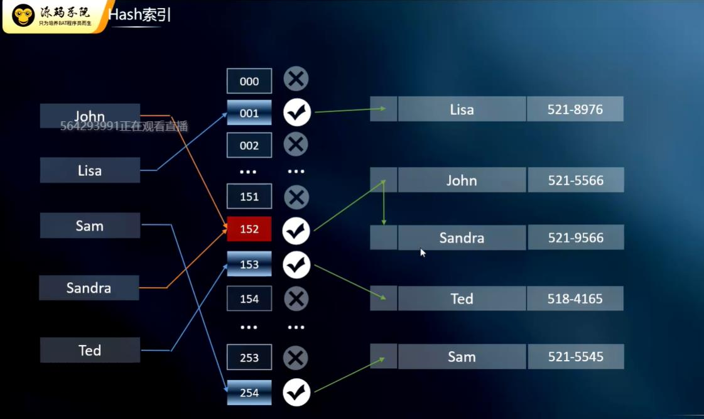
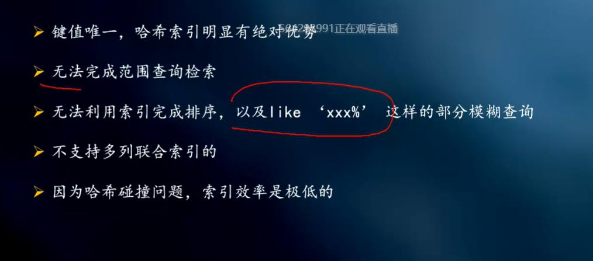

## 获取数据库表结构相关信息
``` sql
SELECT
  COLUMN_NAME 列名,
  COLUMN_TYPE 数据类型,
  DATA_TYPE 字段类型,
  CHARACTER_MAXIMUM_LENGTH 长度,
  IS_NULLABLE 是否为空,
  COLUMN_DEFAULT 默认值,
  COLUMN_COMMENT 备注 
FROM
 INFORMATION_SCHEMA.COLUMNS
where
-- developerclub为数据库名称，到时候只需要修改成你要导出表结构的数据库即可
table_schema ='novel'
AND
-- article为表名，到时候换成你要导出的表的名称
-- 如果不写的话，默认会查询出所有表中的数据，这样可能就分不清到底哪些字段是哪张表中的了，所以还是建议写上要导出的名名称
table_name  = 'user_read_record'
```


## 主从配置
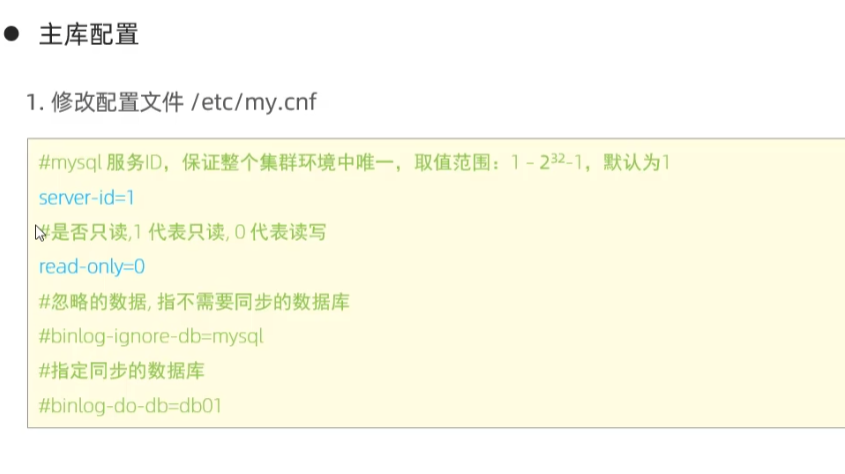
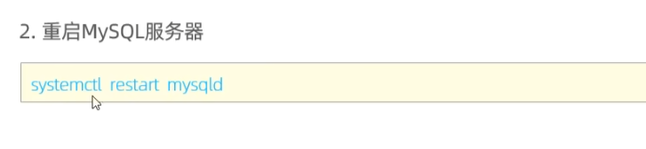
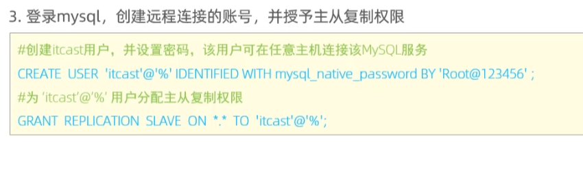
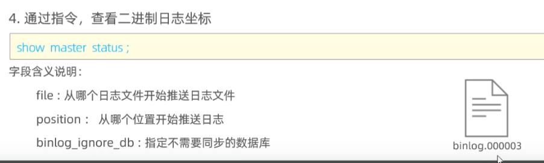
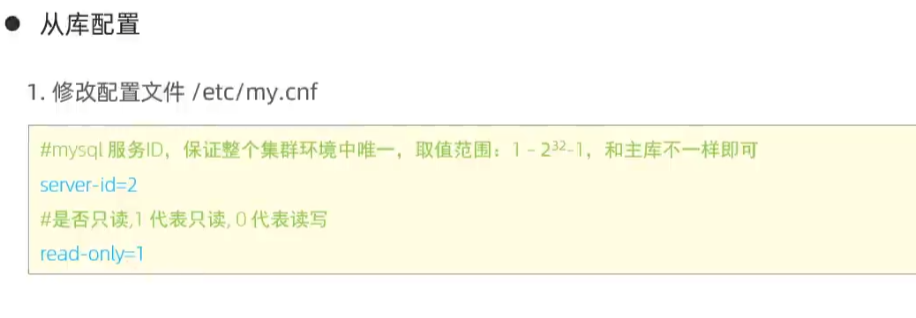
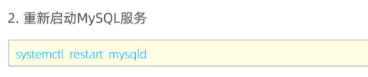
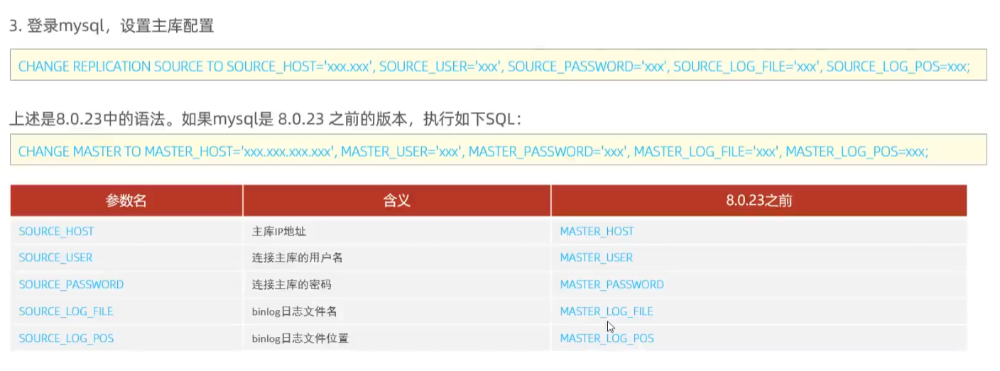
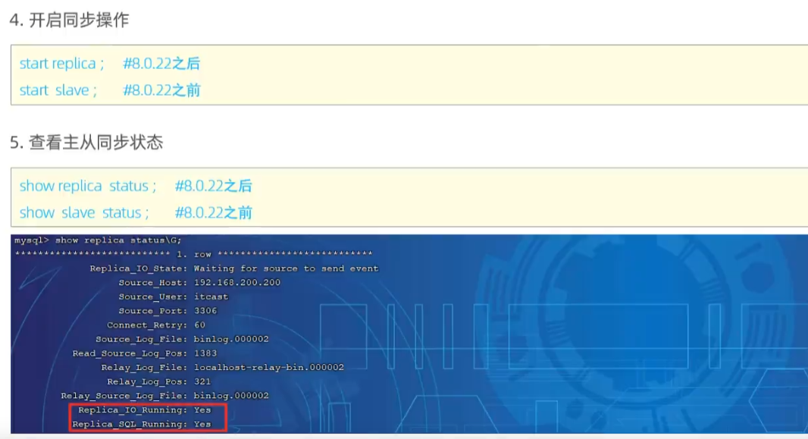
show slave status\G 格式化展示 一行展示 


