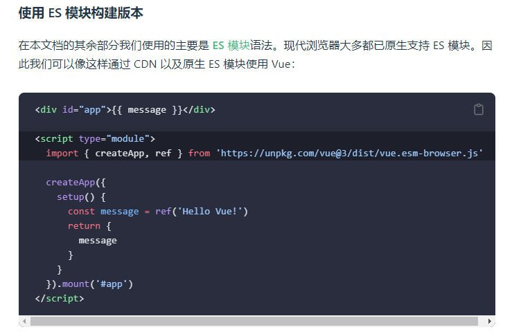
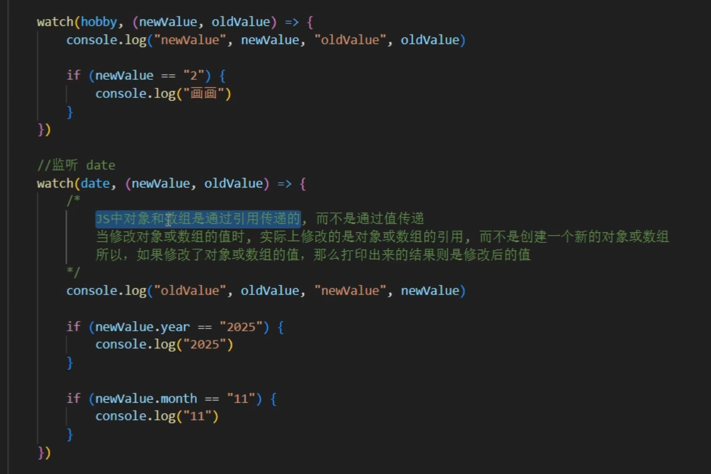
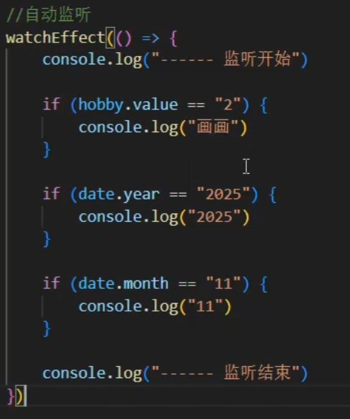
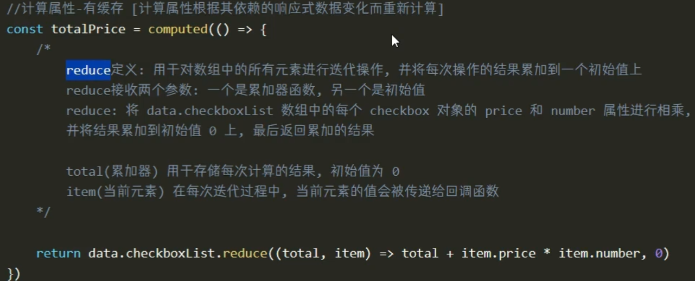
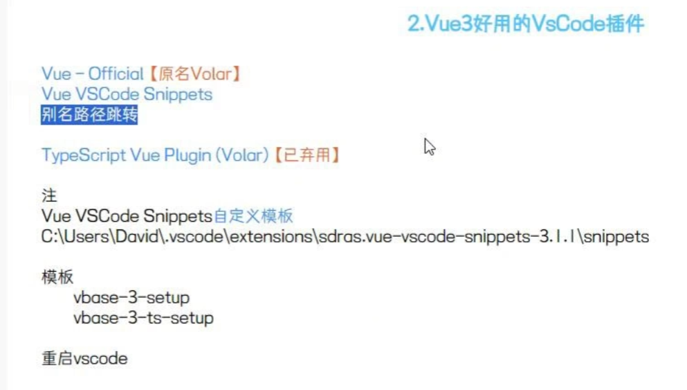
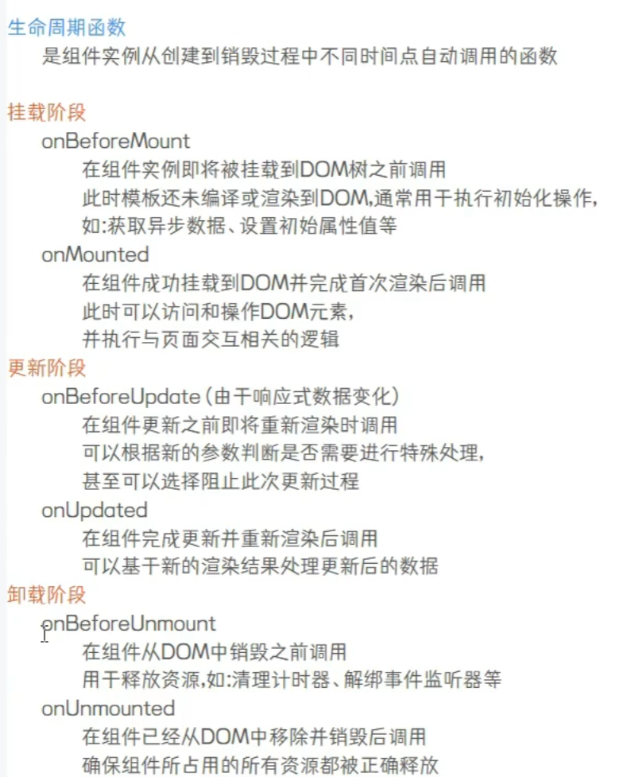
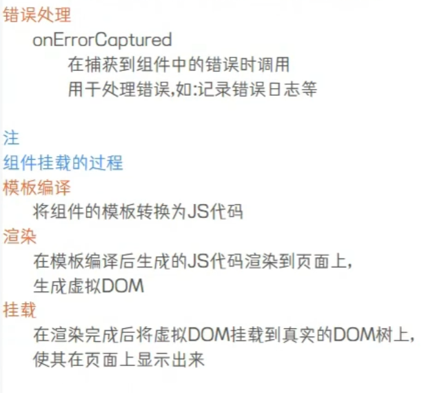
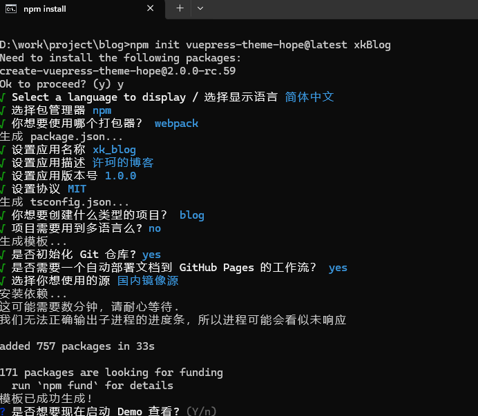

## 传统方式 直接引用
```javascrpt
vue.global.js
```
## 模块化开发 需要用到

模块化是不能使用浏览器直接打开的 需要vscode 安装live server扩展

## ref 和reactive的区别
* ref用于存储数字和字符串
* reactive用于存储比较复杂的对象

## v-on 
事件绑定 简化写法 用@代替
按键修饰符 @keyup.enter  按下回车间 松开时触发 keydown按下触发

## v-show 
显示与隐藏 boolean值 原理是通过修改css的style样式实现的 display:none

## v-if
v-if 显示与隐藏 boolean值 原理是是否渲染的方式 经常切换的话不建议使用 因为会平繁的这dom中添加或移除元素导致性能下降；
结合v-else-if 和 v-else 使用 可以根据值动态渲染需要显示的元素

## v-bind 
与数据绑定 简写方式：

## v-model
* 双向绑定，例如用户手动修改值，绑定变量也随之改变，与bind有区别，默认实时渲染。
* 修饰符 v-model.lazy,不会立即渲染只有在失去焦点或者按下回车才渲染，v-model.trim去掉收尾的空格。

## v-text
将文字进行绑定

## v-html
会解析html格式，可以添加样式等

## watch
监听值变化 新值和旧值变化 使用watch需要导入


## watchEffect
隐藏式 监听 使用watch需要导入


## computed 
计算属性 使用计算属性需要导入



## 创建vue项目基本步骤
创建vue项目
使用vite快速创建
在工作空间文件夹使用cmd命令
执行 npm create vite@latest
删除一些没用的文件 

## vscode 插件


## 组件导入与数据传递
* 组件导入使用import 导入名首字母大写，使用方式直接在template中使用首字母大写标签
* 组件数据传递使用defineProps接收父组件传递的值，使用defineEmits向父组件传递事件
* provide 可以将数据传递给所有子组件类似于map k-v方式，跨辈分传递，使用时需要导入，子组件接收需要导入inject接收数据

## 生命周期函数



## 路由router
安装 npm install vue-router@4
1. 创建router文件夹 存放路由规则
2. 创建一个js文件，创建路由规则，创建路由器，并导出
3. 在main.js文件中 导入路由器，并使用use与vue绑定
4. 在app.vue中 template标签中添加 router-view标签

## 插件安装
``` shell
element-plus
npm install element-plus --save

```

## 使用vuepress 构建个人blog

