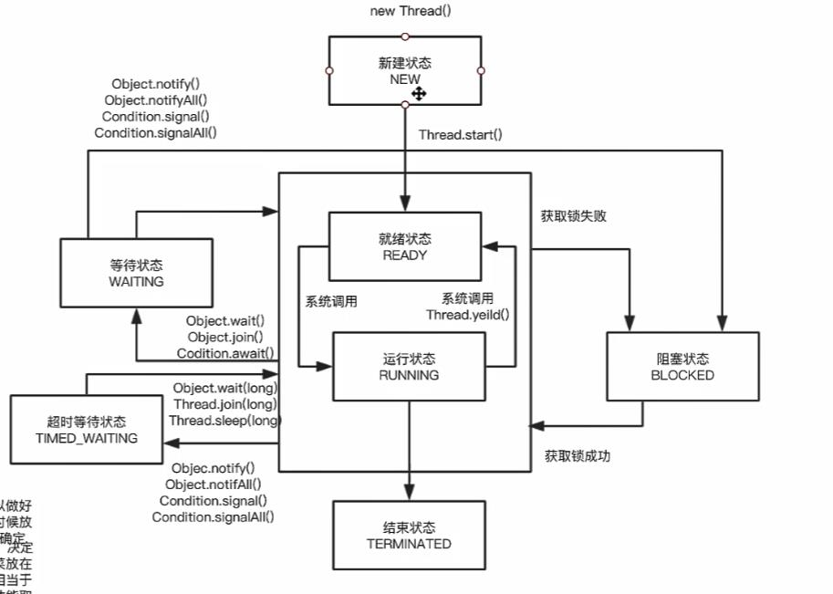

## 进程和线程
* 进程：
    就是正在运行的程序的实例，是一个具有一定独立功能的程序，关于某个数据集合的一次运行活动

* 线程：
    是操作系统能够进行运算调度的最小单位，它被包含在进程中，是进程种的实际运作的单位，一个线程指的是进程种的一个单一顺序的控制流，一个进程中可以并发多个线程，每个线程执行不同的任务。

* 多线程的优点
    可以把占据时间长的任务放到后台去吃力
    程序的运行速度加快

## 实现多线程
 1. 继承Thread类，重写run方法，run方法运行具体业务，start方法启动线程
 2. 实现Runnable接口，重写run方法，实例化一个thread，start方法启动线程
 3. 实现CallAble接口，指定泛型为返回值的类型，实现call方法，实例化CallAble线程，实例化FutureTask将CallAble线程作为参数，再实例化Thread，将futureTask作为参数，start方法启动。

## 线程运行特点
 * 随机性，在多线程编程中，代码的执行结果与代码的执行顺序或调用顺序是无关的。
 * 线程是一个子任务，cpu以不确定的方式或者是以随机的时间来调用线程中的run方法；
 * start的执行顺序与线程的启动顺序不一致

##  成员变量与线程安全
* 自定义线程类中的成员变量针对其它线程可以分为共享与不共享
* 不共享：单独创建线程，成员变量是只能自己使用，其它线程获取不到
* 共享：创建一个线程，将这个线程作为参数传到 new Thread（线程），从而获取线程实例，实现成员变量的共享，但是这样会存在线程安全问题

## 线程的常用API
1. currentThread，获取当前线程的信息 getName
2. isAlive，当前线程是否处于活动状态，（以启动且运行没有结束）
3. sleep，在指定的毫秒数内，让当前线程暂停
4. getId，获取当前线程的唯一标识

## 停止线程
    意味着在线程处理完成任务之前结束正在执行的操作
1. 使用退出标志，使线程正常停止，stopThread（）
2. 使用stop方法，强制停止，线程会产生ThreadDeath异常，会对锁定对象解锁
3. interrupt方法，不会真正的结束线程，在当前线程中打一个停止的标记。通过isInterrupted是否有停止标记；
interrupted方法，获取当前线程是由有停止标记，当调用了interrupted方法后会移除停止标记。
如果线程中有sleep方法，调用interrupted方法会产生异常信息。

## 暂停线程
* suspend方法暂停线程，resume恢复线程运行。
* suspend方法不会释放同步，其它线程无法调用。
* suspend方法会造成共享对象不同步的问题

## yield方法
yield方法的作用是放弃当前的cpu资源，将资源让给其它的任务去占用cpu执行。但是放弃时间不确定，有可能放弃了，马上有获取到cpu资源

## 线程的优先级
* 线程可以划分优先级，优先级较高的线程得到更多的cpu资源
* 设置优先级使用setPriority，优先级分为1-10个级别，不在此范围会报异常
* JDK默认设置3个优先级常量：
    1. MIN_PRIORITY = 1 最小值
    2. NORM_PRIORITY = 5 中间值
    3. MAX_PRIORITY = 10 最大值
* 线程优先级具有继承性，比如线程A启动线程B，线程B与线程A一样的优先级

## 守护线程
* 用户线程和守护线程
* 守护线程是一种特殊线程，当我们进程中不存在用户线程时，守护线程会自动销毁。
* 例如垃圾回收线程。当进程中没有用户线程，垃圾回收线程就没有存在的必要，所以会自动销毁。
* setDaemon方法设置为守护线程，在start方法之前设置

## 线程的同步机制synchronized
线程安全与非线程安全？
不安全：当多个线程访问同一个对象中的成员变量时产生的，产生的后果就是脏读，取到的数据是被更改过的数据
* 局部变量是线程安全的。局部变量是私有的
* 成员变量是线程不安全的。
* synchronized修饰方法，对象锁
* synchronized有锁重入的功能
* synchronized在静态方法上使用是对class类上锁，而非静态方法上是对像上锁。
* synchronized static 和 synchroized（class）作用是一样的
* 同步代码块指定对象上锁

## 死锁
多个线程在运行过程中因争夺资源而造成的一种僵局
### 原因：
1. 系统资源竞争会导致系统的资源不足，资源分配不到，导致死锁
2. 线程运行的顺序不合适，线程运行过程中请求和释放的资源的顺序不当，死锁
### 产生死锁的必要条件：
1. 互斥条件，线程要求对所分配的资源进行排它性控制，及在一段时间内某个资源仅为一个线程所占用。
2. 请求和保持条件：当线程因请求资源而阻塞时，对已经获得的资源保持不释放
3. 不剥夺条件：线程已经获得的资源在未使用之前，不能剥夺，只能在使用完成时自己来释放
4. 环路等待条件：在发生死锁时，必然存在一个线程等待另一个线程的环形链

## 锁对象类容改变
线程A的锁时StringObject = 123，在A运行中改为456，睡50毫秒，
那么另一个线程拿到的StringObject不是123了，而是456，
相当于new了一个对象，那么就不是同一个对象锁了。
但是改变对象中的属性不存在这个问题，只要对象不变。

## volatile关键字
主要作用时使变量可以在多个线程之间可见。
例：
在启动线程时，变量public boolean flag =true 存在在公共堆栈及私有堆栈中，
若使用服务器模式的JVM时，为了线程运行的效率，线程一直在私有堆栈中获取flag的值，
一直为true，当改变了flag值后，虽然改变了，更新的确实公共堆栈中的flag，所以一直是死循环的状态。
使用volatile修饰成员变量后，强制虚拟机从公共堆栈中获取变的值。

## volatile和snychroized区别
1. volatile时线程同步的轻量级实现，性能比synchroized更好，并且volatile只能修饰变量，synchronized修饰方法和代码块，jdk高版本以对synchronized进行优化，效率还是不错的。
2. 多线程访问volatile时不会发生阻塞，而synchronized会出现阻塞。
3. volatile能保证可见性，不能保证原子性。而synchronized可以保证原子性，也可以间接保证可见性，因为它会将私有内存和公共内存中的数据做同步。
4. volatile解决的是变量多个线程之间的可见性，而synchronized解决的是多个线程之间访问资源的同步性。

## 线程间的通讯
线程是程序中独立的个体，如果不经过处理就不能成为一个整体，线程间的通讯时是成为一个整体的比用方案之一，可以说线程之间的通讯后，线程之间的交互性更强大，使CUP利用率更高，大大提供程序猿对各线程任务在处理中的把控和监督。
可使用volatile来实现线程间的通讯，但需要用到while轮询来获取数据，浪费cpu资源
### wait 和 notify机制 (等待通知机制)
wait 和notify方法只能在同步方法或者同步代码块中使用，两者必须是锁定的同一对象，才能将其唤醒。wait方法执行后会释放锁，当notify方法不会释放锁，会执行完成同步代码后释放。
如果多个线程等待，调用notify方法只会随机唤醒一个线程，使用notifyAll方法会唤醒所有线程。
wait（long time） wait方法会在time时间内等待被唤醒，如果超过time时间还没被唤醒，会自动唤醒。这和sleep作用相同的，但是区别是sleep是不会释放锁的，但wait会释放锁。
### join方法
作用是等待线程对象销毁。
例如：主线程创建了子线程，子线程做大量耗时的运算，主线程早于子线程结束，但主线程想等待子线程完成之后再结束，比如子线程处理一个数据，主线程需要取得这个数据中的值，那么就可以使用join方法来实现
基本用法就是在主线程中调用子线程的join方法，那么主线程会等子线程完成之后再执行下面代码。主线程将会一直等待子线程结束，造成阻塞效果。类似于同步的效果，但是join使用的是wait/notify实现的，而同步使用的是对象锁
### ThreadLock类
变量值共享可以使用静态变量形式，所有线程都可以使用同一个静变量。如果想每个线程都有自己的共享的变量，就可以使用ThreadLock类来实现，每个线程绑定自己的值。

### Lock
ReentranLock在扩展功能上更强大，比如具有嗅探锁定，多路分支通知等，比synchronized更加灵活lock.lock()方法加锁，lock.unlock()方法解锁
lock要实现线程之间的通讯，需要结合condition类来实现，使用它有更好的灵活性，比如多路通知功能，也就是在一个Lock对象中创建多个condition实例，线程对象可以注册在指定的condition中，从而可以有选择性的进行线程通知，在调用线程上更灵活。
使用notify/notifyAll，被通知的线程是由JVM随机选择的，但使用ReentranLock结合condition类可以实现选择性通知。这样效率也大大提高了。使用lock.newCondition()方法获取condition实例，使用condition.await() 实现线程等待，使用condition.signal()方法进行唤醒

## 公平锁和非公平锁
在实例reentranLock时 无参构造方法是非公平锁，通过boolean参数true时时公平锁，反之既然。公平锁是线程获取锁的顺序是按照加锁的顺序来分配的，也就是先来先得。非公平锁是随机的。

## ReentranReadWriteLock
ReentranLock是一个互斥排他锁，即只有一个线程可以在lock方法后面的任务。虽然安全性可以保证，但是性能较低。在某些情况不需要操作变量，就可以使用读写锁来提升效率。
读写锁有两个锁，一个是读操作也称为共享锁，一个是写操作也称为排他锁。也就是多个读锁之间不是互斥的，读锁与写锁是互斥的，写锁与写锁也是互斥的

## 线程状态
* NEW：尚未启动的线程处于这种状态
* RUNNABLE：在Java虚拟机中	正在运行的线程处于这种状态
* BLOCKED：被阻塞等待对象锁的线程处于这种状态
* WAITING：等待另一个线程运行的线程处于这种状态
* TIME_WAITING;等待另一个线程运行，到指定时间的线程处于这种状态
* TERMINATED:已经退出运行的线程处于这种状态

## 各种状态的关系图：

## 线程池
减少创建和销毁线程次数，每个线程可重复利用，可同时执行多个任务，可以根据系统的承受能力，调整线程池中工作线程的数量，防止消耗过多的内存，服务器崩溃。

### java线程池的顶级接口时Executor
比较重要的几个类：
* ExecutorService：真正的线程池接口
* ScheduleExecutorService：解决需要重复执行的任务，周期性
* ThreadPoolExecutor：ExecutorService默认的实现
* ScheduleThreadPollExecutor:继承ThreadPoolExecutor的ScheduleExecutorService接口的实现，周期性的任务调度的类实现

### Executors提供了一些静态工厂，生成常用的线程池
1. newCachedThreadPool(ThreadPoolExecutor的方法)
创建一个可缓存的线程池，如果线程池大小超过了处理任务所需要的线程，就会回收部分空闲的线程（60s没有执行的线程），当任务数量增加时，线程池可以智能的添加新的线程来处理任务。这个线程池不会对线程池的大小进行限制，线程池的大小完全是依赖操作系统（JVM）能够创建的最大线程大小。
2. newFixedThreadPool（ThreadPoolExecutor的方法）
创建固定大小的线程池，每次提交一个任务就创建一个线程，直到线程池达到最大大小。线程池一旦达到最大值，就会保持不变。如果某个线程异常结束，那么线程池就会补充一个新线程。
3. newSingleThreadPool（ThreadPoolExecutor）
创建一个单线程的线程池。这个线程池只有一个工作线程，也就是单线程串行执行所有任务。如果这个线程异常结束，那么会有一个新线程替代它。此线程池保证所有任务的执行顺序会按照任务的提交顺序来执行。
4. newScheduleThreadPool（ScheduleTheadPoolExecutor）
创建一个大小无限的线程池，这个线程支持定时以及周期性执行任务的需求。
5. newSingleThreadSchedulePool（scheduleThreadPoolExecutor）
创建一个单线程，用于定时以及周期性的执行任务的需求。

