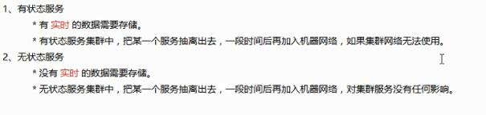

## 1.kubernetes使用场景？
* 自动化的运维平台，中小企业可以使用k8s构建一套自动化运维平台
* 充分利用服务器的资源，容器化的方式
* 服务无缝迁移，通过容器化的方式，镜像
及k8s是管理容器的

## 2.服务部署模式变迁以及服务部署模式是如何变迁的？
* 物理机部署（直接把服务部署到物理机上，会浪费物理机资源）
* 虚拟化（虚拟机）方式（把服务部署到虚拟机上，虚拟机分割物理资源，以达到充分利用服务器资源，但虚拟机本身就比较消耗资源）
* 容器化的方式部署

## 服务部署模式变化，带来哪些问题？
SOA架构，微服务架构模式下，服务拆分的越来越多，部署维护的服务越来越多。

## 如何去管理服务？
虚拟机方式（使用openstack）
容器（k8s，管理容器）

## 以下问题k8s都可以轻松搞定
面临些什么问题？
服务如何横向扩展？
容器宕机怎么办？数据怎么恢复？
重新发布新的版本如何更新，更新后不影响业务？服务迁移，滚动更新
如何监控容器？
容器如何调度创建？
数据的安全性如何保证？

## 云架构 和 云原生 ？
### 云和k8s是什么关系
    云就是使用容器构建的一套服务集群网络
    k8s用来管理云中的容器
### 云架构
* iaas 基础设施即服务
    用户：租用云主机，用户就不需要考虑网络，DNS，存储，硬件环境等相关问题
    运营商：提供网络，存储，DNS，基础设施服务
* paas 平台及服务
    mysql，es，mq 等服务都提供了
* saas 软件服务
    钉钉，财务管理软件
* serverless
    无服务，不需要服务器
    站在用户的角度考虑的，用户使用的云服务器即可
### 云原生
就是为了让应用程序（项目，服务软件）都运行在云上的解决方案，这样的方案叫云原生。
特点： 
    * 容器化 --- 所有服务部署在容器中
    * 微服务 --- 微服务架构
    * CI/CD --- 可持续交互和可持续部署
    * devOPS --- 开发和运维密不可分

## kuberbetes架构
google使用go语音开发的。
### master节点
* API server  k8s的网关，所有的指令请求都要经过 api server
* scheduler 调度器，使用调度算法，将请求资源调度某一个node节点上
* controller 控制器，维护k8s资源对象（CRUD）
* etcd 存储资源对象
### node节点
* docker 容器引擎，运营容器的基础环境
* kubelet 在每个node节点都存在一份，在node节点上的资源操作指令由kubelet执行
* kube -proxy 代理服务，作用是负载均衡，在多个pod之间负载
* fiuent 日志收集服务
* pod 是k8s管理的基本单元（最小单元），pod内部是容器，k8s不直接管理容器，而是管理pod
master与node关系是 一个master对应一群node节点

## pod核心原理
pod是什么？可以认为是容器（这个容器中装的是docker创建的容器，pod是装容器的容器），pod是一个虚拟化的分组（有自己的ip地址，主机名），相当于一台独立的沙箱环境。pod相当于独立主机，可以封装一个或者多个容器。一套服务的所有容器，nginx，mysql，web服务等，再加上一个pause容器，作用是共享网络和共享存储

## replicaSet副本控制器
* replicaSet和replicationController 都是副本控制器
* 副本控制器的作用是控制pod的数量，设置了数量，那么k8s会始终保持pod的数量与设置的一致，如果其中一个pod挂了，会马上创建一个。
* 它们两个的区别是replicaSet可以单选或者多选，replicationController只能单选。通过标签选择器来实现选择相关pod。

## deployment 部署对象
服务部署结构模型
滚动更新
deployment和replicaSet一起使用，版本更新会创建一个新的replicaSet，从而新建pod

## statefulset 部署有状态服务
部署模型
有状态服务
状态服务的解释：

模型与deployment类似，statefulset保证pod重新建立之后，hostname不会发生变化，pod就可以通过hostname来关联的数据

## pod访问流程
pod是一个容器，里面装的是容器，对外提供访问，首先要对物理机进行访问 ip+端口，通过转发的方式映射到pod上

## 多个pod副本如何实现负载均衡？
使用新的组件 service来实现负载均衡
### 什么是service？
* pod IP pod的ip地址
* node IP 物理机的ip地址
* cluster IP 是由k8s抽象出的service对象，这个对象就是一个vip（虚拟ip）的资源对象，是一个进程-资源对象
* 使用虚拟ip service来进行负载均衡
### service 和pod 是如何关联的呢？ 
利用的是标签选择器