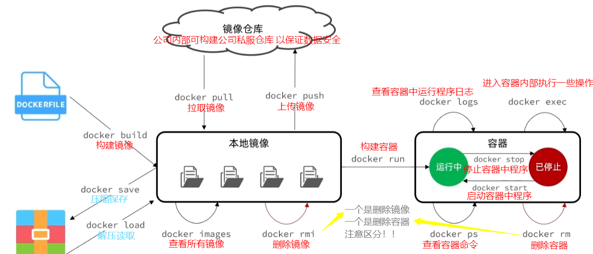
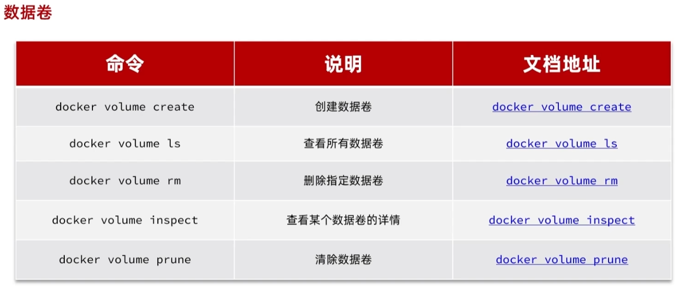
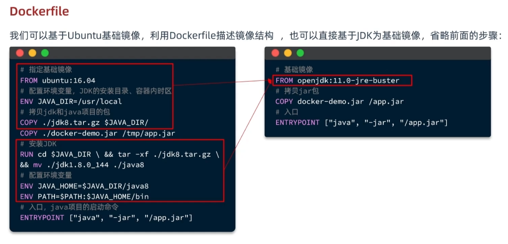
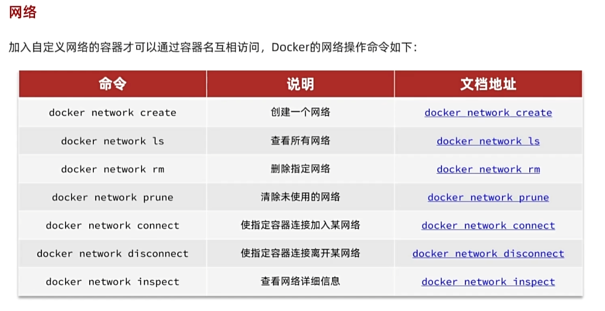
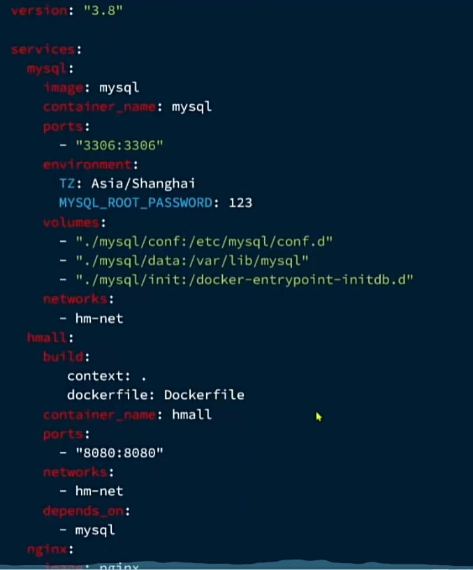
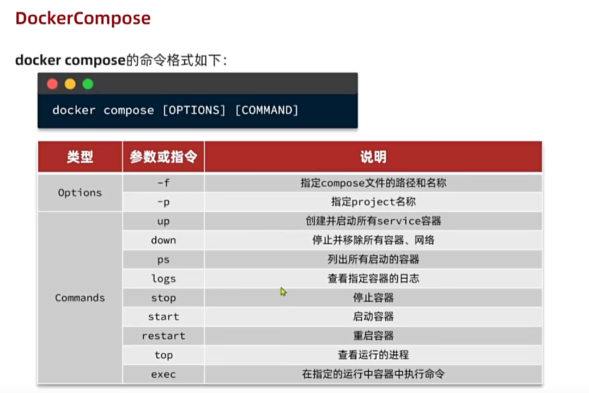
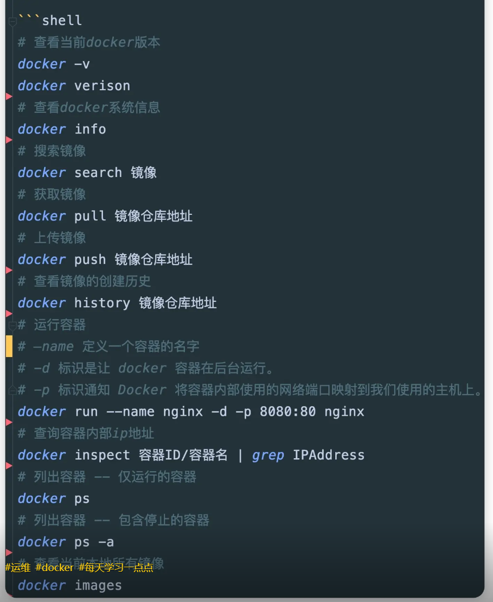
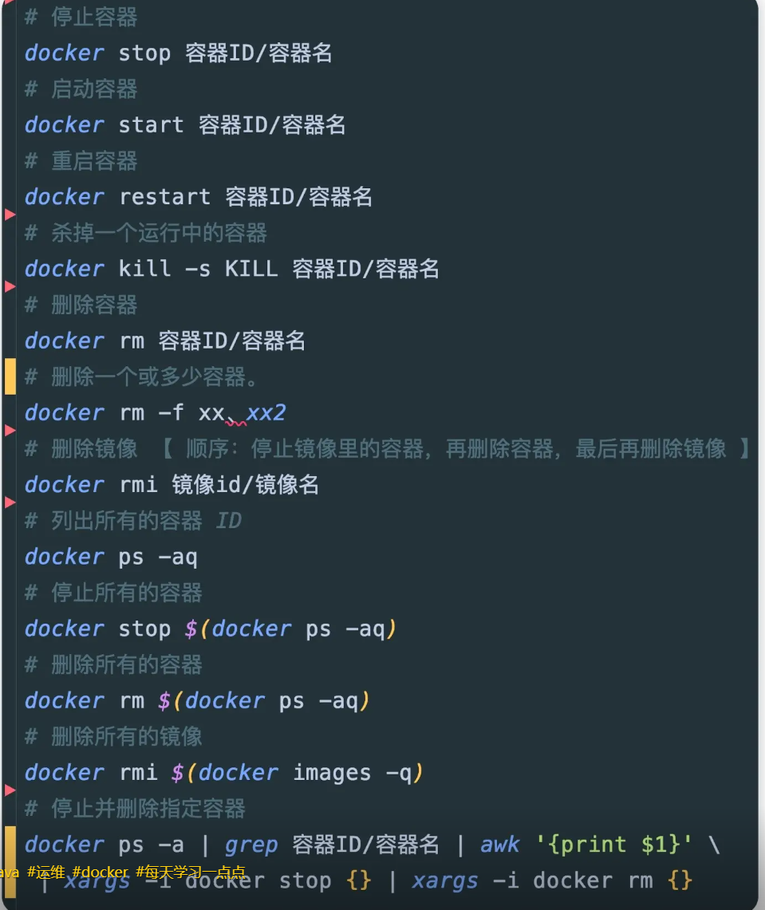
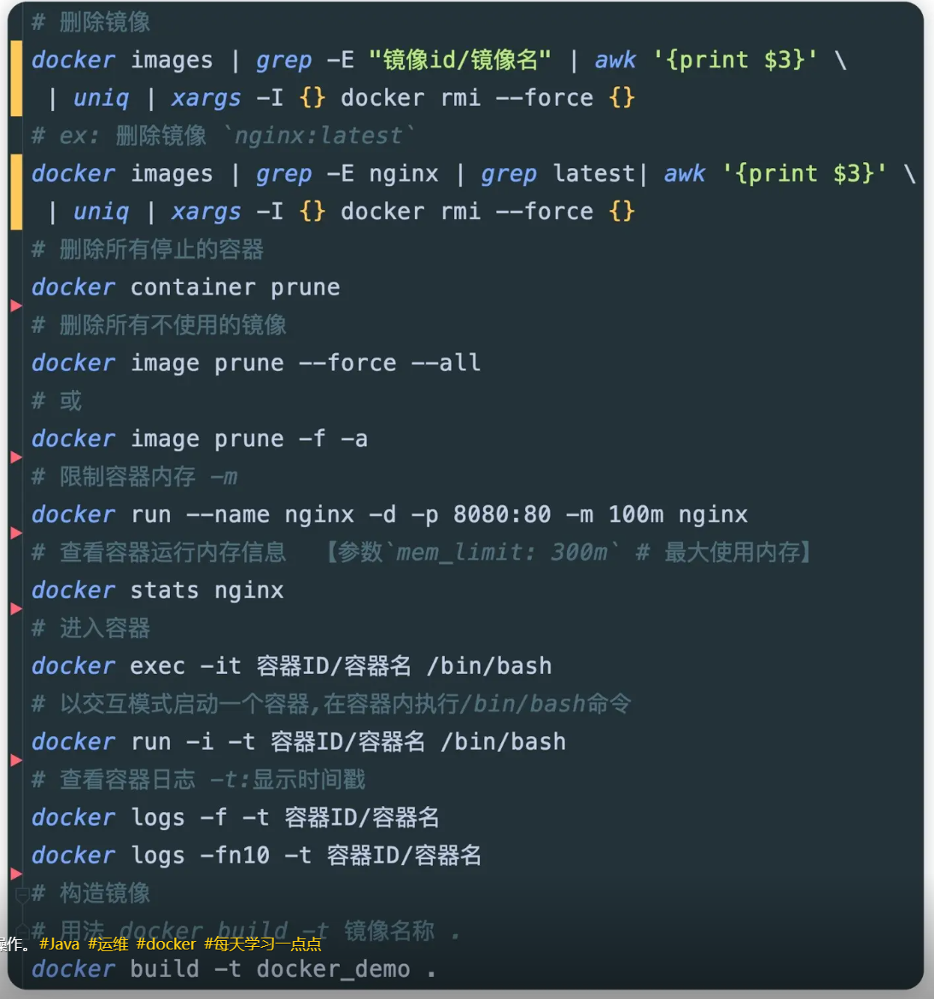

## docker官网安装教程
[docker官网安装教程](https://docs.docker.com/engine/install/centos/)


## docker run 命令解读
-d          让容器在后台运行
--name     //给容器命名（唯一）
-p         //端口映射 宿主机端口：容器内端口
-e          //设置环境变量 结构为key=value 具体参数可参考镜像库
-v        //挂载数据卷 结构 数据卷:容器内的目录
--network    //加入指定网络
[全球镜像库地址](https://hub.docker.com) https://hub.docker.com
一般最后为镜像名   repository（镜像名）：tag（镜像版本）
在没指定tag时，默认是latest，最新版的镜像

## 流程图


docker exec -it 容器名 bash 进入容器使用命令行交互

数据卷与容器内部程序文件系统 相互绑定便于修改 




### 自定义镜像 dockerfile

构建镜像
docker build -t 镜像名 dockerfile目录 （当前目录用.代替）

### 网络


### dockerCompose
yml文件


#### dockercompose 命令



### 常用安装示例
``` shell
#reids
docker run -p 6379:6379 --name redis -v /root/redis/redis-conf:/etc/reids/reids.conf -v /root/redis/data:/data -d redis redis-server  --appendonly yes --restart=alwags

#mysql
docker run --name mysql -p 3306:3306 -v /root/mysql/conf:/etc/mysql/conf.d -v /root/mysql/data:/var/lib/mysql -v /root/mysql/init:/docker-entrypoint-initdb.d -e MYSQL_ROOT_PASSWORD=xk123456 -e TZ=Asia/Shanghai -d mysql:tag


#jenkins
docker pull jenkins/jenkins:2.414.2
docker run -d -u root -p 8080:8080 -p 50000:50000 -v /var/jenkins_home:/var/jenkins_home -v /etc/localtime:/etc/localtime --name jenkins jenkins/jenkins:2.414.2
docker start jenkins

#minio 文件服务器
docker run -p 9000:9000 -p 9090:9090 \
 --name minio \
 -d --restart=always \
 -e "MINIO_ACCESS_KEY=minioroot" \
 -e "MINIO_SECRET_KEY=minioadminroot" \
 -v /mydata/minio/data:/data \
 minio/minio server \
 /data --console-address ":9090" -address ":9000"


#nacos
docer search nacos
docer pull nacos/nacos-server
# 镜像拉完之后，启动脚本
docker run -d \
  --name nacos \
  --privileged  \
  --cgroupns host \
  --env JVM_XMX=256m \
 --env MODE=standalone \
  --env JVM_XMS=256m \
  -p 8848:8848/tcp \
  -p 9848:9848/tcp \
  --restart=always \
  -w /home/nacos \
  nacos/nacos-server


#xxl_job
docker search xxl-job
docker pull xuxueli/xxl-job-admin:2.4.0

docker run  -d \
        -p 8088:8088\
        -v /tool/xxl-job/logs:/data/applogs \
        -v /tool/xxl-job/application.properties:/xxl-job/xxl-job-admin/src/main/resources/application.properties \
        -e PARAMS="--server.port=8088\
        --spring.datasource.url=jdbc:mysql://117.72.14.166:3306/xxl_job?useUnicode=true&characterEncoding=UTF-8&autoReconnect=true&serverTimezone=Asia/Shanghai \
        --spring.datasource.username=root \
        --spring.datasource.password=Wing1Q2W#E" \
        --name xxl-job-admin  \
xuxueli/xxl-job-admin:2.4.0
```

### docker常用命令






