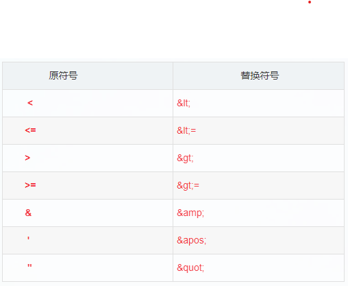

## mybatis是什么
orm框架半自动化，对象关系映射
## 操作
链接，操作，结果
## mybatis加载mapper文件的几种方式
1. ‌通过 resource 属性指定 XML 文件路径‌
在 mappers 标签中使用 mapper resource 指定 Mapper XML 文件的类路径（相对 resources 目录）。
``` xml
<mappers>
  <mapper resource="mapper/UserMapper.xml"/>
</mappers>
```
‌适用场景‌：

* XML 文件与接口分离（如 XML 在 resources/mapper 目录，接口在 java 目录）。
* 需显式指定每个 XML 文件路径。
‌注意‌：路径基于类路径（classpath），无需考虑包结构。‌
***
2. ‌通过 class 属性指定 Mapper 接口‌
直接声明 Mapper 接口的全限定名：
``` xml
<mappers>
  <mapper class="com.example.mapper.UserMapper"/>
</mappers>
```
限制‌：

‌同名同包规则‌：接口与对应的 XML 文件必须‌同名‌（如 UserMapper.java 和 UserMapper.xml），且位于‌同一包路径‌（Java 类在 src/main/java 下，XML 需在 src/main/resources 的相同子目录）。
‌适用场景‌：注解与 XML 混合开发时。‌
***
3. ‌通过 package 批量扫描包‌
自动扫描指定包下的所有 Mapper 接口：
``` xml
<mappers>
  <package name="com.example.mapper"/>
</mappers>
```
‌限制‌：

同样需满足‌同名同包规则‌（接口与 XML 文件同名且同路径）。
‌优势‌：简化配置，适合大型项目批量加载
***
4. ‌通过 url 指定绝对路径（较少用）
使用文件系统绝对路径加载远程或本地 XML：
``` xml
<mappers>
  <mapper url="file:///D:/mappers/UserMapper.xml"/>
</mappers>
```
‌适用场景‌：

XML 文件不在项目类路径中（如外部磁盘文件）。
‌缺点‌：路径依赖环境，可移植性差
***
5. ‌运行时动态加载（扩展方式）‌
通过编程方式在代码中动态注册 Mapper：
``` java
sqlSessionFactory.getConfiguration().addMapper(UserMapper.class);
```
‌适用场景‌：

SQL 需动态生成（如根据业务拼接 XML 节点）。
框架集成或特殊定制需求
***
总结与建议：
| 方式 | 配置 | 使用场景 | 同名同包要求 |
| :-: | :-: | :-: | :-: |
| resource | mapper resource="path.xml" | XML 与接口分离 | ❌ |
| class | mapper class="com.XxxMapper" | 显式指定单个接口 | ✅ |
| package | package name="com.mapper" | 批量加载接口	| ✅ |
| url | package name="com.mapper" | 加载外部 XML 文件 | ❌ |
| 动态加载 | 代码注册 addMapper() | 运行时定制 SQL | ❌ |

## mybatis有几种执行器？
三种，简单、重用、批量
1. SimpleExecutor（简单执行器）‌
    * ‌核心机制‌
    每次执行 SQL 都会创建新的 Statement 对象，执行完毕立即关闭。
    * ‌特点‌
    ❌ 无缓存机制，重复执行相同 SQL 时需频繁创建/销毁 Statement。
    ⚡️ 轻量级，适合简单查询场景。
    * ‌适用场景‌
    单次、低频的 SQL 操作，或对数据库连接资源要求不高的场景。‌

2. ReuseExecutor（复用执行器）‌
    * ‌核心机制‌
    以 SQL 语句为 Key 缓存 Statement 对象，相同 SQL 复用已有对象，避免重复创建。
    * ‌特点‌
    💾 缓存 Statement 减少资源开销。
    ️同一会话（SqlSession）内有效，会话结束后自动释放。
    * 适用场景‌
    高频执行相同 SQL 的批量查询场景（如循环查询同一模板语句）。‌

3. BatchExecutor（批处理执行器）‌
    * 核心机制‌
    将多个 SQL 操作（仅限 update/insert/delete）合并为批量请求一次性提交。
    * 特点‌
    🚫 ‌不支持 SELECT 语句‌（JDBC 批处理限制）。
    大幅提升批量数据操作的效率（如导入大量数据）。
    * ‌配置要点‌
    需显式调用 flushStatements() 提交批处理任务。‌

## mybatis缓存
mybatis一级缓存默认是开启的 二级是需要手动开启的
* 一级缓存怎么使用？怎么创建？
    * 一级缓存是默认开启的 作用域是sqlSession级别的同一个sqlSession，执行同一个sql时会使用一级缓存，底层使用的是一个hashMap来存储的，key为hashCode+statement+sql
    * 二级缓存是mapper级别的以namespace为单位的 在mapper.xml 使用cache标签开启
## mybatis中符合替换

## mybatis 插入数据自动生成主键
在 MyBatis 中，使用 selectKey 标签配合 order="AFTER" 可以在插入语句执行后获取生成的主键值，并通过 keyProperty 将主键值赋给实体对象的指定属性。
* 核心属性说明
    * keyProperty‌
    指定实体类中接收主键值的属性名（如 id），MyBatis 会将生成的主键值自动注入该属性‌。
    * order="AFTER"‌
    表示 selectKey 中的 SQL 在插入语句‌执行后‌运行，适用于自增主键（如 MySQL 的 AUTO_INCREMENT）‌。
    * resultType‌
    定义主键值的数据类型（如 java.lang.Long 或 java.lang.String）‌。
* 代码示例：
``` xml
<insert id="insertUser" parameterType="com.example.User">
  INSERT INTO user(username) VALUES(#{username})
  <selectKey resultType="java.lang.Long" keyProperty="id" order="AFTER">
    SELECT LAST_INSERT_ID()
  </selectKey>
</insert>
```
## mybatis一对多查询
* 方式一 嵌套查询
    * 将sql语句嵌套，一条sql可查询出数据，但是存在问题 limit分页失效 会以多方来分页
    * 通过单次 SQL 联表查询，在 resultMap 中使用 collection 标签封装关联数据。
    * 特点‌：单次查询效率高，但需注意联表字段别名避免冲突‌
    * 示例场景‌：查询部门及其下属员工（一个部门对应多个员工）
    ``` xml

    <resultMap id="deptWithEmployees" type="Department">
    <id property="id" column="dept_id"/>
    <result property="name" column="dept_name"/>
    <!-- 一对多关联 -->
    <collection property="employees" ofType="Employee">
        <id property="id" column="emp_id"/>
        <result property="name" column="emp_name"/>
    </collection>
    </resultMap>

    <select id="selectDeptWithEmployees" resultMap="deptWithEmployees">
    SELECT d.id AS dept_id, d.name AS dept_name,
            e.id AS emp_id, e.name AS emp_name
    FROM department d
    LEFT JOIN employee e ON d.id = e.dept_id
    </select>

    ```
* 方式二 关联查询
    * 将sql语句关联，一方查一方的数据，多方查多方的数据，limit分页支持，但sql有1+N条
    * 通过多次查询，先查主表，再根据主键查关联表。使用 column 指定关联字段，select 指定子查询方法‌。
    * ‌特点‌：支持懒加载，但可能引发 N+1 查询问题‌
    * 示例场景‌：查询订单及其明细（一个订单对应多个明细）‌。
    ``` xml
    <resultMap id="orderWithDetails" type="Order">
    <id property="id" column="order_id"/>
    <collection 
        property="details" 
        column="order_id" 
        ofType="OrderDetail"
        select="selectDetailsByOrderId"/>
    </resultMap>

    <select id="selectOrderWithDetails" resultMap="orderWithDetails">
    SELECT * FROM orders WHERE id = #{id}
    </select>

    <select id="selectDetailsByOrderId" resultType="OrderDetail">
    SELECT * FROM order_detail WHERE order_id = #{order_id}
    </select>
    ```
## 使用'%#{}%'存在问题
在 MyBatis 中使用 '%#{}%' 进行 LIKE 模糊查询时，确实会因预编译机制导致语法错误或查询失效。以下是具体问题分析和解决方案：
1. ‌问题原因‌
‌预编译占位符冲突‌：#{} 会被解析为 ? 占位符，而直接拼接 '%?%' 会导致 SQL 语法错误（引号嵌套冲突）‌。
‌引号自动添加‌：#{} 生成的参数值会被自动加上单引号，形成 '%'value'%' 的错误格式‌。
2. ‌解决方案‌
    1. 使用 CONCAT 函数拼接
    通过 SQL 函数动态拼接 % 和参数值，避免引号冲突：
    ``` xml
    <select id="searchByKeyword" resultType="User">
    SELECT * FROM users 
    WHERE username LIKE CONCAT('%', #{keyword}, '%')
    </select>
    ```
    优点‌：安全（防 SQL 注入），兼容性强‌
    2. 参数预拼接（Java 层处理）
    在 Java 代码中提前拼接 %，再通过 #{} 传递：
    ``` JAVA
    String keyword = "%" + userInput + "%";
    userMapper.search(keyword); 
    ```
    注意‌：需确保 userInput 已过滤特殊字符‌
    3. 使用 ${} 谨慎拼接
    直接替换参数（需严格校验输入，避免 SQL 注入）：
    ``` XML
    WHERE username LIKE '%${keyword}%'
    ```
    ‌适用场景‌：仅限内部安全参数（如动态表名）
3. ‌安全建议‌
* 优先选择 #{} + CONCAT‌：兼顾安全性与功能性‌。
* 禁用未过滤的 ${}‌：用户输入直接拼接 ${} 会导致 SQL 注入风险‌。
4. ‌性能优化‌
* ‌索引失效问题‌：LIKE '%value%' 会导致索引失效，建议改用 LIKE 'value%' 或全文检索‌。
* 大数据量优化‌：对模糊查询频繁的字段可考虑添加全文索引‌。

## 关于if判断
* if判断里传入0时的问题
因为mybatis中会自动把0当成null 判断时只需要 status！=null 就行了
* if判断字符串
    1. ‌基本字符串相等判断‌
    ‌正确写法‌：字符串需用单引号包裹，或显式调用 toString() 方法‌。
    ``` xml
    <if test="status == 'ACTIVE'">...</if>  <!-- 单引号包裹 -->
    <if test="status == 'Y'.toString()">...</if>  <!-- 显式转换 -->
    ```
    ‌错误示例‌：直接比较单字符（如 'Y'）可能被误判为 char 类型，引发 NumberFormatException‌。
    2. ‌空字符串与非空判断‌
    需同时检查 null 和空字符串‌56：
    ``` xml
    <if test="name != null and name != ''">...</if>
    ```
    ‌简化写法‌：若仅需排除 null，可省略空字符串判断‌。
    3. ‌字符串包含判断‌
    使用 contains 方法（需注意 OGNL 表达式语法）‌：
    ``` xml
    <if test='str.contains("substr")'>...</if>
    ```
    ‌模糊匹配‌：结合 LIKE 和 CONCAT 实现‌：
    ``` xml
    <if test="keyword != null">
    AND title LIKE CONCAT('%', #{keyword}, '%')
    </if>
    ```
    4. ‌特殊场景处理‌
    ‌单字符问题‌：单个字符（如 '1'）需用双引号或 toString() 避免类型冲突‌：
    ``` xml
    <if test='flag == "1"'>...</if>  <!-- 双引号包裹 -->
    ```
    ‌数字型字符串‌：直接比较可能被误判为数字，建议显式转换‌：
    ``` xml
    <if test="code == '1'.toString()">...</if>
    ```
    5. ‌动态 SQL 组合‌
    结合 where 标签避免多余 AND/OR‌：
    ``` xml
    <select id="search">
    SELECT * FROM table
    <where>
        <if test="param1 != null">AND col1 = #{param1}</if>
        <if test="param2 != null">AND col2 LIKE #{param2}</if>
    </where>
    </select>
    ```
    * 注意事项
        * 类型安全‌：避免 ${} 直接拼接字符串，优先使用 #{} 防注入‌。
        * 调试技巧‌：若条件不生效，检查日志中生成的 SQL 是否包含预期片段‌。
