## spring cloud 
spring cloud 是一系列框架的有序集合，通过springboot 进行融合

## 注册中心
Eureka 服务注册中心 
包括两个组件 ：EurekaServer（服务注册）和EurekaClient（通过注册中心进行访问）
cp：高可用 没接收到服务心跳 产生自我保护机制不会马上删除服务 默认90秒
服务端启动类@EnableEurekaServer
客户端启动类@EnableEurekaClient

## zookeeper 服务中心
启动类添加@EnableDiscoveryClient
ap：强一致性 没接收到服务心跳马上 删除服务 所以服务在zk中的节点是零时节点带序列号

## consul 服务中心 go语言写的 默认端口8500
满足ap
启动类添加服务发现注解@EnableDiscoveryClient

## Ribbon 负载均衡服务调用（restTemplate的 rest调用）
客户端负载均衡工具，本地负载均衡
Ribbon和nginx的区别
在调用微服务接口的时候，会从注册中心拿到注册服务列表，缓存到jvm本地，从而在本地实现RPC远程服务调用
nginx是服务端的负载，客户端所有请求都会交给nginx，然后nginx转发请求

### 负载规则：
1. RoundRibonRule 轮询
2. RandomRule 随机
3. 	先按照轮询获取，如果获取服务失败则在指定
4. WeightedResponseTimeRule 响应速度快 权重越大
5. BestAvailableRule 	过滤断路跳闸的服务，选择并发小的服务
6. AvailabilityFilteringRule	先过滤故障实例，选择并发小的服务
7. ZoneAvoidanceRule	复合判断server所在区域的性能和server的可用性选择服务器
修改负载规则 配置类不能在启动类包内
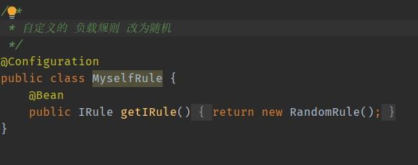
Feign 服务接口绑定器 接口加注解就可以调用
调用方添加接口和注解
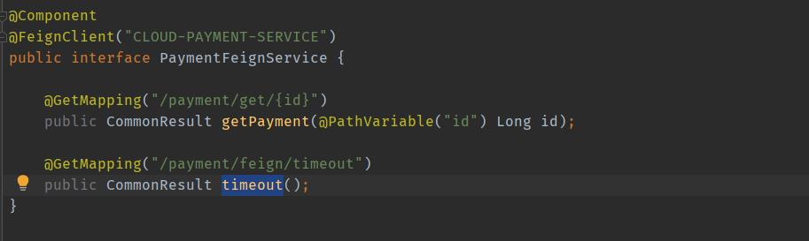
@Component 将此接口交给spring管理 用于controller注入
@FeignClient 填写需要调用的服务名称
接口中的方法为实际调用的服务地址及方法

日志增强功能 调用接口时打印相关数据
添加配置类和yml配置
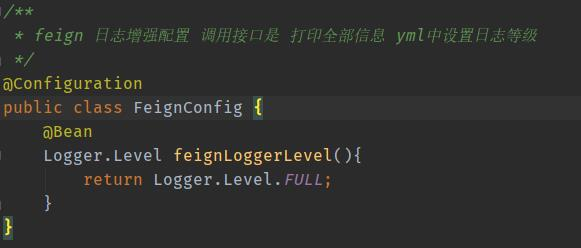
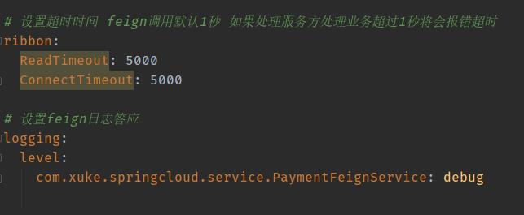

## Hystrix 服务熔断 服务降级 避免级联故障
降级（fallback） 熔断（break） 限流（flowlimit）

fallback 服务出现异常后，给一个兜底方案，预估数据，给调用方一个符合预期的备选响应
break 服务不可用了，不可访问，类似于保险丝，调用降级的方法，检测正常后恢复调用链路
flowlimit 高并发限流，避免过多连接而导致服务崩溃
*jmeter工具压力测试

服务端和客户端都可以做服务降级 但一般在客户端做服务降级
主启动类添加注解，服务方法上添加降级注解
客户端需要在配置文件添加配置

### 客户端：
配置添加 feign对hystrix的支持
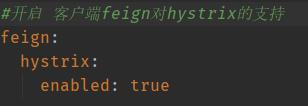
服务接口类，feign指定降级实现类
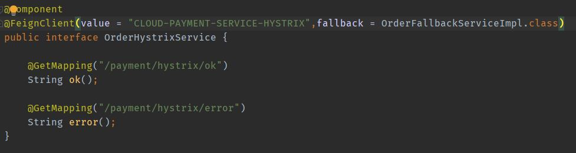
降级实现类，实现服务接口所有方法实现方法降级结果
### 服务熔断 服务端
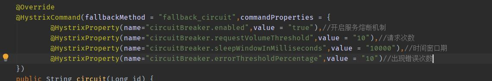

## 网关 gateway
 基于Netty实现 高性能的Reactor模式 非阻塞异步模型
 三大核心： 路由，断言，过滤
 两种路由配置 ： 1.配置yml文件，2.RouteLocator的bean 配置类进行配置
 断言（predicates）：及匹配规则更加细腻度的匹配
 过滤功能：需要实现GlobalFilter,Ordered 两个接口

## config 统一配置 增强管理
联合github、gitee、gitlab等使用，实现统一配置
配置中心服务端启动类添加@EnableConfigServer
yml配置:
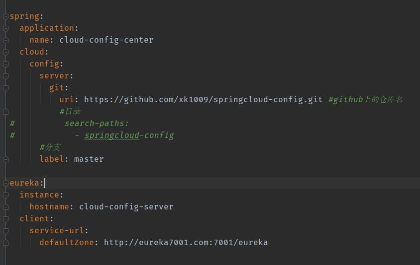
主要是配置github地址，以及配置注册中心

配置客户端
bootstrap.yml 此配置文件时系统级的 优先级高于application.yml
使用bootstrap来读取配置中心的配置
配置文件修改后，客户端动态获取配置信息，需要actuator依赖
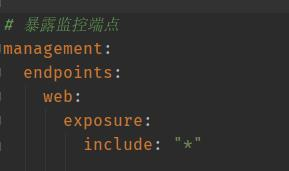
修改配置中心的文件后 向客户端发送curl -X POST "http://localhost:3355/actuator/refresh" 进行刷新
避免了重启服务器

## Bus 消息总线
支持两种消息代理 rabbitMQ和Kafka

订阅同一个主题，只需要向configserver发送一个刷新post请求，其它微服务都订阅了同一个主题就会广播到所有微服务上

服务端 添加bus-amqp依赖
添加配置：

mq配置在spring下
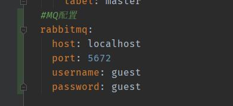
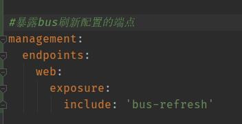

通过发送post请求可刷新所有微服务，也可指定微服务刷新
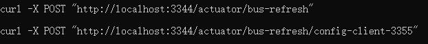

## stream 消息驱动 
事件驱动的微服务框架
屏蔽底层消息中间件的差异，降低切换成本，统一消息的编程模型
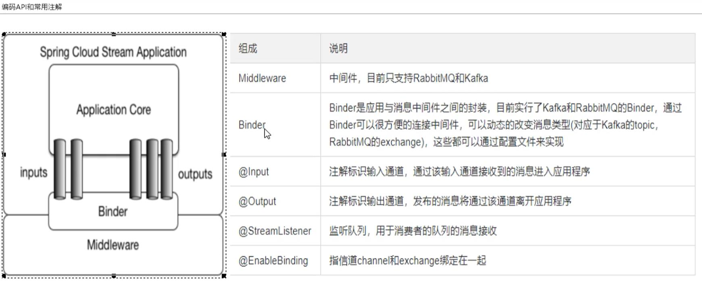

## Sleuth 分布式请求链路跟踪
springcloud F版之后 使用直接下载  zipkin jar包运行
[下载地址](https://dl.bintray.com/openzipkin/maven/io/zipkin/java/zipkin-server/)
