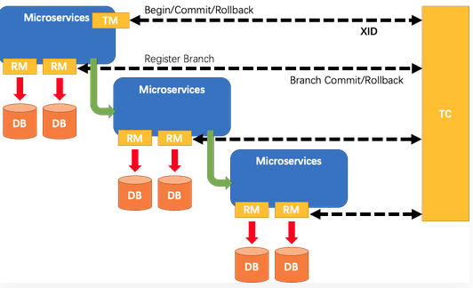
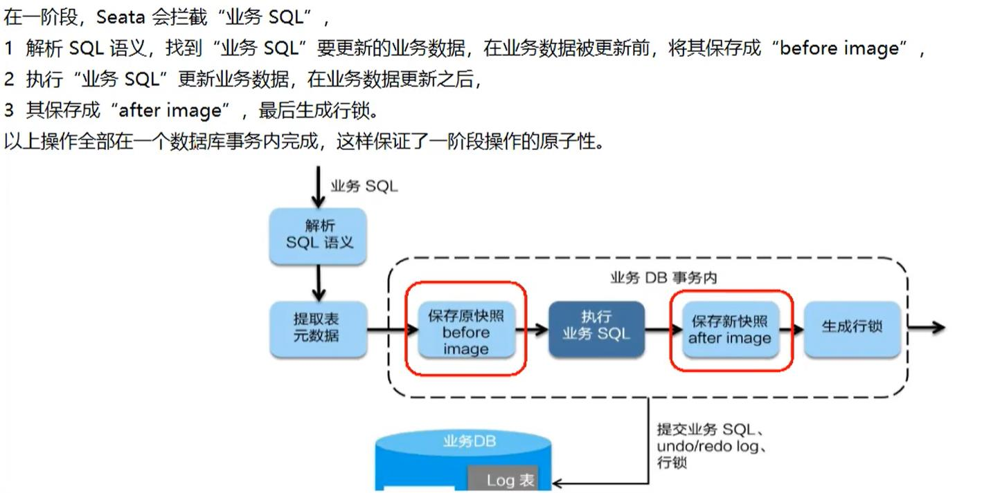
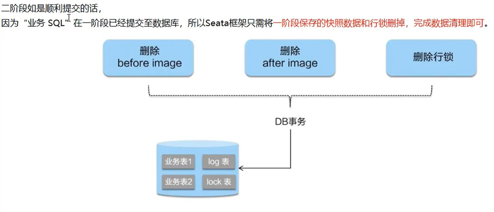
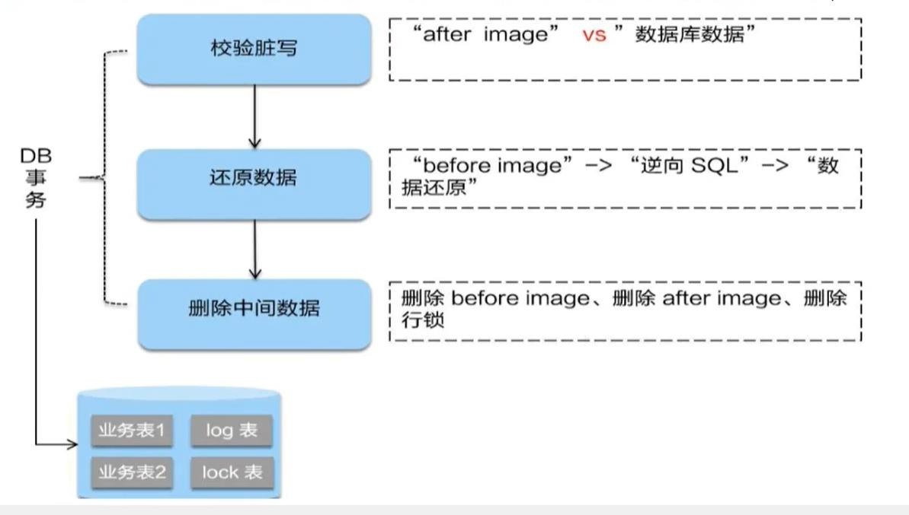

## nacos
nacos组件 用于服务注册与发现，配置管理，服务消息总线
nacos支持负载均衡  ribbon的restTemplate
nacos可切换 cp 和 ap 模式切换
post请求进行切换
nacos集群 与 持久化
deby数据库自带的 

## sentinel 服务的监控与限流，降级，熔断

流控规则
* 线程数 请求进来只有设置的线程数工作，当满足不了时 报错
* 资源名：唯一名称，默认请求路径
* 针对来源：sentinel可以针对服务调用者进行限流，填写微服务名称，默认default（不区分来源）
* 阈值类型/单机阈值：
    * QPS（每秒请求数量）：当调用该api的QPS达到阈值时进行限流
    * 线程数：当调用该api的线程数达到阈值时限流
* 是否集群：不需要集群
* 流控模式：
    * 直接：api达到限流条件时，直接限流
    * 关联：当关联的资源达到阈值时，就限流自己
    * 链路：只记录指定链路上的流量（指定资源从入口资源进来的流量，如果达到阈值，就进行限流）【api级别的针对来源】
* 流控效果：
    * 快速失败：直接失败，抛出异常
    * warm up：根据codefactor （冷加载因子，默认3）的值，从阈值除以codefactor，经过预热时长，才达到设置的QPS阈值
    * 排队等待：匀速排队，让请求以匀速的速度通过，阈值类型必须时QPS，否则无效

降级规则
* TR（平均响应时间，秒级）：
    * 平均响应时间 超出阈值 且 在时间窗口内通过的请求>=5，两个条件同时满足时触发降级
    * 窗口期过后关闭断路器
    * RT最大4900（更大的值 需要通过 -Dcsp.sentinel.startistic.max.rt=XXX才能生效）
* 异常比例（秒级）：
    * QPS>=5 且异常比例（秒级统计）超过阈值，触发降级；窗口期过，关闭降级
* 异常数（分钟级）：
    * 异常数，分钟级统计超过阈值触发降级，窗口期过，关闭降级

热点规则
* 结合 @SentinelResource使用 配置 blockhandler 指定方法
* @SentinelResource注解使用
* blockHandler适用于违反规则的 返回方法
* fallback适用于运行时异常的 返回方法
* 规则在每次重启微服务时会消失，需要配置存进nacos中，这样就不用每次重启服务配置规则了

规则返回方法必须携带BlockException 这个异常类
运行异常返回方法必须携带throwable 这个异常类

## seata 分布式事务的解决方案

[官网](https://seata.apache.org/zh-cn/)很详细的文档
一加三 组件模型
    全局唯一的事务ID
三组件
* TC - 事务协调者
    * 维护全局和分支事务的状态，驱动全局事务提交或回滚。
* TM - 事务管理器
    * 定义全局事务的范围：开始全局事务、提交或回滚全局事务。
* RM - 资源管理器
    * 管理分支事务处理的资源，与TC交谈以注册分支事务和报告分支事务的状态，并驱动分支事务提交或回滚。
流程：
1. TM 向 TC 申请开启一个全局事务，全局事务创建成功并生成一个全局唯一的XID
2. XID 在微服务调用链路上下文中传播
3. RM 向 TC 注册分支事务，将其纳入 XID 对应的全局事务的管辖
4. TM 向 TC 发起针对 XID 的全局提交或者回滚决议
5. TC 调度 XID 下管辖的全部分支事务完成提交或者回滚请求

配置：
 下载解压后，
    file.config文件修改
        组名默认default XXX_tx_group
        修改存储方式为db
        修改db连接地址及账户密码
    register.config 文件选择注册中心
注意：seata1.0.0暂不支持mysql8，需要修改驱动，https://www.pianshen.com/article/5424990143/

### 默认采用AT模式
一阶段加载，二阶段提交，二阶段回滚
一阶段：

二阶段顺利提交：

二阶段失败回滚：

