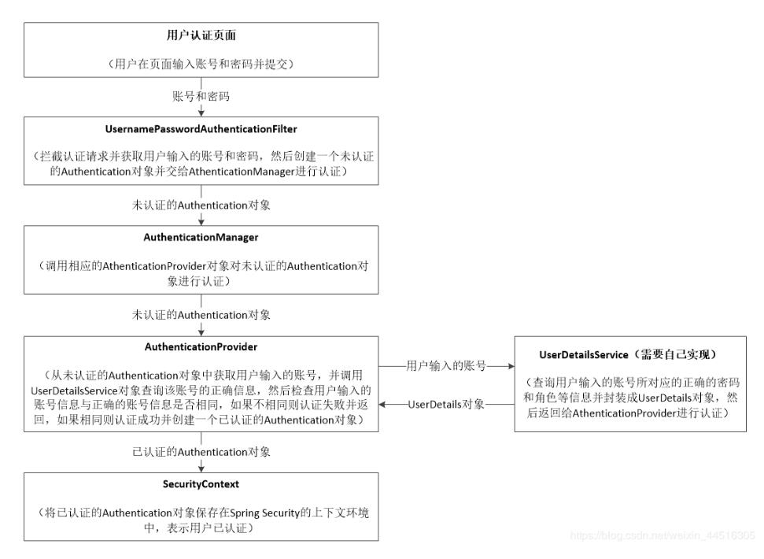
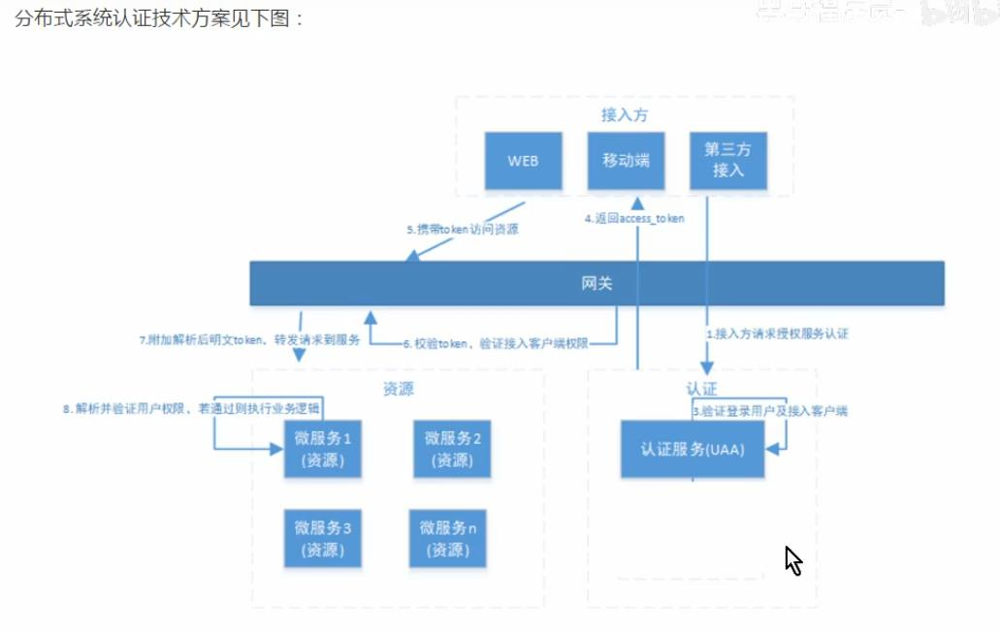
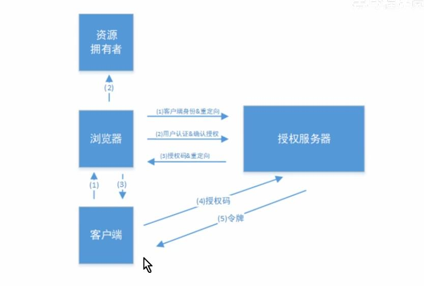
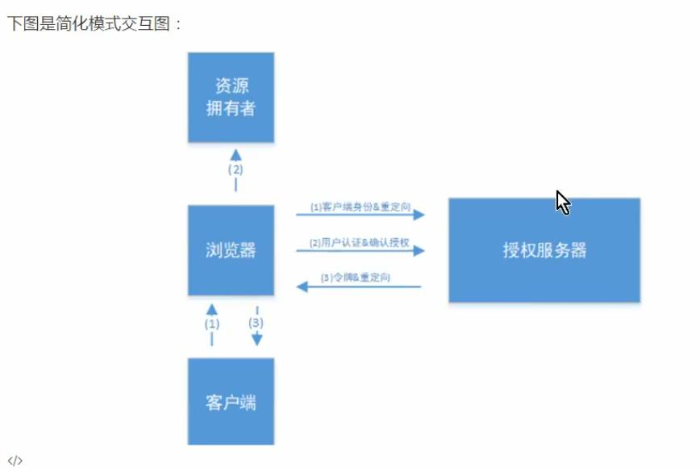
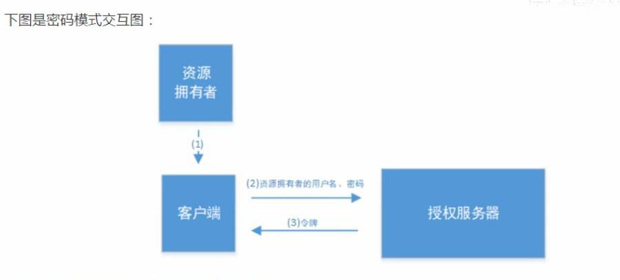
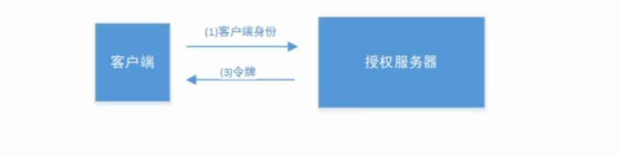

## springSecurity oAuth2  shiro
oAuth2 协议 标准
spring 提供了资源认证授权 资源保护的解决方案
[博客园相关资料](https://www.cnblogs.com/xwgblog/p/12131527.html)
## 常用的是基于用户名和密码的认证方式

* 认证：
  就是判断一个用户的身份是否合法的过程，用户去访问资源时系统要求验证用户的身份信是否合法，合法可以继续访问，不合法不问。
* 会话：
  用户认证通过之后，为了避免每次操作都要认证，可将用户信息保存在会话中，常见的就是session和token的方式
* 授权：
  用户认证通过后根据用户的权限来控制访问资源的过程
### 数据模型：
分为三大类：
  1.主体（subject）2.资源（resource）3.权限（permission）
  主体有哪些权限可以访问哪些资源
  用户表——用户角色表——角色表——角色权限表——权限表（权限对应资源）
RBAC：
  基于资源的访问控制，根据用户有哪些权限资源来进行控制
  例如：部门组长有审批的权限标识
  if（主体.havePermission(审批标识)）{
    进行审批操作。。
  }
  后期需要对部门经理也有这样的权限，在角色中添加权限标识，代码就不用更改
  基于角色的访问控制就存在弊端
## 基于session的认证方式：
1. 用户登录，认证成功后，
2. 在服务端将用户的信息保存在session中， k：sessionId v：用户信息
3. 返回sessionId到客户端
4. 客户端将sessionId保存到cookie中
5. 再次发生请求携带cookie访问
6. 服务端从cookie中获取sessionId 验证是否有session数据
7. 用户退出或session过期销毁，sessionId也就无效了

## 拦截器
spring-security提供了认证拦截的功能不需要自己写拦截器
配置类 需要extends WebSecurityConfigurerAdapter 添加注解@EnableWebSecurity
配置类中配置三个
1. 定义用户信息服务（用于查询用户信息）
2. 密码编码器
3. 安全拦截机制（重要 相当于拦截器）
## 过滤器
springSecurity是使用filter链来实现用户请求的过滤（FilterchainProxy）
AuthenticationManager（认证器） AccessDecisionManager（授权器）主要由这两个来处理
重要过滤器
 securityContextPersistenceFilter 这个过滤器是整个拦截过程的入口和出口
 UsernamePasswordAuthenticationFilter 用于处理来自表单提交的认证
 FilterSecurityInterceptor 用于保护web资源，使用AccessDecisionManager对当前用户进行授权访问
 ExceptionTranslationFilter 用于捕获来之FilterChain所有异常，并处理。
## security认证流程：
1. 用户提交用户名密码
2. UsernamePasswordAuthenticationFilter拦截
3. AuthenticationManager
4. DaoAuthenticationProvider
5. 调用userDetailsService（自定义）查询用户信息，通过密码编码器（Bcrypt常用）进行比对，权限信息填充
6. 返回Authentication（认证信息）
## security授权流程：
1. 认证后的用户访问受保护资源
2. 获取当前资源所需要的权限
3. accessDecisionManager投票决策（三种决策方式 默认采用只有有1票通过就决策通过的原则）
  * 只要有1票支持就决策为通过
  * 比较支持票和反对票数量来决策
  * 只要有1票反对就决策为不通过

## 支持自定义登录页面 登出 会话 
设置session是否创建 如果是分布式系统采用token的方式保存用户信息，就可以设置为不创建session

## 授权有两种方式 一种是web授权（基于url的拦截） 一种是方法授权
方法授权：使用方法授权 需要开启注解支持 在配置类中添加@EnableGlobalMethoSecurity（securedEnabled=ture）

## 注解
@PreAuthorize（执行方法之前），@PostAuthorize（执行方法之后），@Secured 
使用注解都需要开启注解支持

## 分布式系统认证方案
对所有服务进行统一的认证
对外部应用提供统一接入功能

一般会采用token的方式，不建议采用session的方式，主要是因为session需要统一存储或者session复制，对于移动互联网应用也存在问题 session是基于cookie的，移动端对cookie不能有效的使用，并存在跨域问题

认证服务器 对OAuth2中的两个角色进行认证授权，分别是资源拥有者、客户端

## spring-security-oauth2框架
包含对接入端	以及登录用户的合法性进行校验并颁发凭证token
* AuthorizationEndpoint 服务于认证请求。默认URL：/oauth/authorize
* TokenEndpoint 服务于访问令牌的请求。默认URL：/oauth/token
* OAuth2AuthenticationProcessingFilter 用来对请求给出的身份令牌进行解析鉴权

## 授权服务器配置
用@EnableAuthenticationServer注解并继承AuthenticationServerConfigurerAdapter来配置oAuth授权服务器，重写父类三个方法

* ClientDetailsServerConfigurer配置客户端详情。作用是支持哪些客户端（客户端信息放到数据库中【clientId，secret,授权类型...】客户端需要通过客户端id和秘钥来申请令牌）

* AuthorizationServerEndpointConfigurer配置令牌的访问端点和令牌服务（token services）。令牌单独配置在外面方便管理再注入到本类使用，令牌服务配置一个beanServices：客户端信息服务，是否刷新令牌，令牌的存储策略，令牌默认有效时间，刷新令牌默认有效时间；令牌访问端点配置：密码模式，授权码模式，令牌服务

* AuthorizationServerSecurityConfigurer配置令牌端点的约束。配置提供公有秘钥端点，jwt令牌，/oauth/token_key全部放行，检测令牌端点，/oauth/check_token全部放行

## 令牌单独配置 tokenConfigurer
令牌的存储策略 将会采用JWT令牌的方式 配置是否对称加密算法

## 授权码模式 
最安全的模式

## 简化模式 
主要针对的是没有服务器的第三方单页面应用，因为没有服务器端就无法接收授权码

## 密码模式  
会将密码泄露给客户端，因此一般这种方式都是使用在自己开发的客户端

## 客户端模式 
这种方式最方便但是最不安全，适用于完全信任的应用

## 资源服务配置
@EnableResourceServer注解来标注为是一个资源服务，并继承ResourceServerConfigurerAdapter类
  配置resourceId常量标识为这个资源的标识 
  复写父类两个方法 
    设置资源id，验证token服务（在一个项目中可以直接使用，不在一个项目中使用远程服务请求授权服务校验token，采用jwt需在项目中配置tokenconfig类）
    http访问配置
配置安全访问控制配置

## JWT令牌
  应为校验token采用的是远程较远，当访问量过大，会对性能产生影响。于是JWT就是解决这个问题的
  用户认证通过后得到JWT令牌，JWT令牌中包括了用户的相关信息，客户端只需要携带JWT令牌访问资源服务，资源服务会根据事先约定的算法自行对令牌校验，无需每次都请求认证服务来完成校验工作。
### 优点：
* jwt基于json，非常方便解析
* 可以在令牌中自定义丰富的的内容，扩展性高
* 通过非对称加密算法及数字签名技术，jwt防止被篡改，安全性高
* 资源服务使用jwt可自行校验并获得授权信息
### 缺点：
* jwt令牌较长，占存储空间比较大（可以接受的范围内）