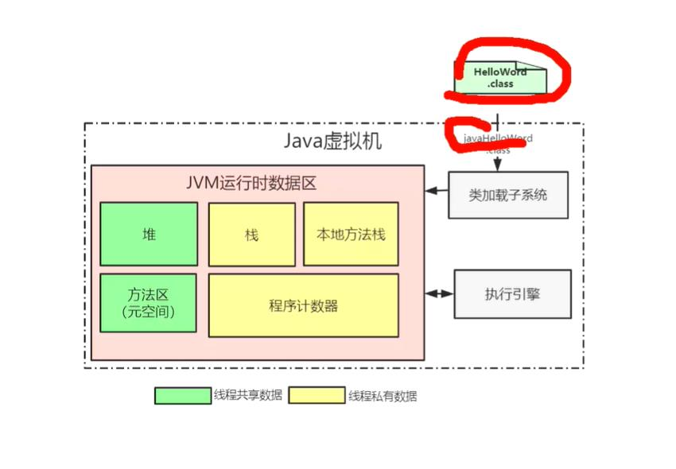
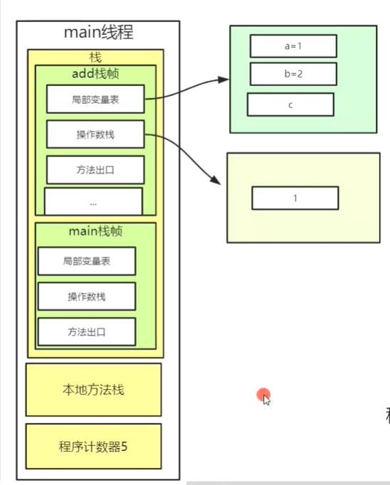
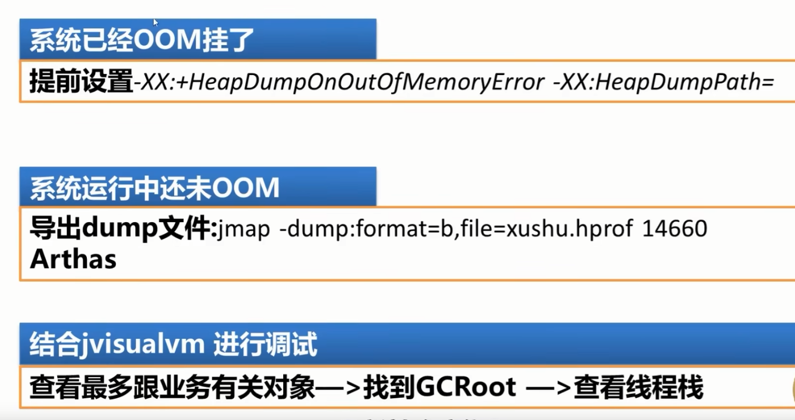

## JVM
jvm是虚拟机  跨平台的 虚拟机对应不同版本 屏蔽了底层的指令化差异

## jdk jre（运行时环境） jvm

一个方法就是一个栈帧

## javap 反编译 class文件



## native修饰的调用的是本地方法栈

## 元空间存着类信息

## 性能调优
针对堆内存调优
堆 新生代（eden from to 8：1：1）和老年代  比例是1：2

## 为什么需要性能调优呢？
程序=数据结构+算法
当对象创建过多时 设置一个临界点（处理不使用的对象）避免内存溢出
在有限的空间做无限的事
eden 满了会触发minor gc
gc root 可达性算法 回收
15次gc之后还在使用的对象 会晋升到老年代 4bit 最大 15
from对象大于占from内存的50% 会晋升到老年代

<font color="red" >
    老年代满了 full gc   stop the word （STW）停止服务 出现卡顿 规避full gc
</font>

## 为什么分为新生代和老年代？ 
这是一种淘汰的策略

## jvm类加载
加载，链接【验证，准备，解析】，初始化
### 加载阶段
* 将.class文件中的二进制数据从磁盘读取到内存中，将其放在运行时数据区的方法区中，然后在堆内存创建对象
* Class对象是存放在堆区的，不是方法区，这点很多人会犯错。类的元数据才是存在方法区的。
* 元数据并不是类的Class对象。Class对象是加载的最终产品，类的方法代码，变量名，方法名，访问权限，返回值等等都是在方法区的
### 链接阶段分为【验证，准备，解析】
1. 验证阶段：
    验证类型，数据等等，此阶段不是必须的，可使用-Xverifynone 来关闭大部分验证 （了解即可）
2. 准备阶段：
    * jvm只会为类的成员变量分配内存空间（以及static修饰的变量）
    * 此时变量值为数据默认值，例如：static int age = 18，此时的数据值为0，而不是18
    * 当使用final static int age = 18 ；此时的数据值为18；final修饰 最终的（不可更改），所以jvm在准备阶段将值赋予变量
3. 解析阶段：
    把类中的符号引用装换为直接引用，就是在常量池中寻找类，接口，字段，和方法的符号引用，把这些符号应用替换为直接引用

### 初始化阶段 对静态变量赋予正确的初始值
一般来说，当对类的首次主动使用的时候才会导致类的初始化，所以主动使用又叫做类的加载过程中的“初始化”开始的时机
#### 类的主动使用包括6种：
1. 创建类的实例，也就是new的方式
2. 访问某个类或者接口的静态变量，或堆静态变量赋值（final修饰除外，或者说放入常量池中的静态数据除外）
3. 访问类的静态方法
4. 反射（例如：Class.ForName("com.xxx.xxx")）
5. 初始化某个类的子类，其父类也会被初始化
6. java虚拟机启动时被标记为启动类的类（例如：javaTest），还有main方法的类会首先被初始化
7. jdk1.7后提供了动态语音支持

* 注意一点对静态字段，只有直接定义这个字段的类才会初始化（执行静态代码块），在继承，多肽中表现最为明显

* 接口初始化与普通类有所不同的是：
    类初始化时，其所有父类都已经被初始化，但接口初始化时不需要其父类全部初始化，是在需要用到父类接口时才会初始化
* 被动使用：
    除以上7中动态使用外，其他使用java类的方式都被看做是对类的被动使用，被动使用不会导致类初始化

* 注意：
    * 初始化 类 构造器：jvm会按顺序收集类变量的赋值语句，静态代码块，最终组成类的构造器由jvm执行
    * 初始化 对象 构造器：JVM 会按照收集成员变量的赋值语句、普通代码块，最后收集构造方法，将它们组成对象构造器，最终由 JVM 执行。值得特别注意的是，
    如果没有监测或者收集到构造函数的代码，则将不会执行对象初始化方法。对象初始化方法一般在实例化类对象的时候执行。

## 垃圾收集器
1. Serial 收集器：
    * 适用于单核或者较小的应用场景。
    * 用于要求低延迟、低吞吐量的应用。
    * 适合移动设备或嵌入式系统等资源受限的环境。
2. Parallel 收集器：
    * 适用于需要最大吞吐量的多核处理器环境。
    *用于后端数据处理等对吞吐量要求较高的应用。
3. G1 收集器：
    * 适用于大内存、多核处理器环境。
    * 用于需要更可控的 GC 停顿时间的应用。
    * 适合需要更可预测的 GC 行为的大型应用。
4.CMS 收集器：
    * 适用于对停顿时间敏感的应用。
    * 用于需要短暂 GC 停顿时间的应用。
    * 适合 Web 服务器等对响应时间要求高的应用。

## java线上诊断方法
1. 原生方法
    * Linux原生命令 top、printf
    * jdk自带命令工具 jstack、jstat
2. Arthas（阿尔萨斯）
    * 阿里开源针对java的线上诊断工具
    * Arthas  [githup官网](https://github.com/alibaba/arthas)
    * Arthas 支持JDK 6+，支持Linux/Mac/Windows，采用命令行交互模式，
    * 同时提供丰富的 Tab 自动补全功能，进一步方便进行问题的定位和诊断
3. show-busy-java-theads(淘宝开源)
    * show-busy-java-threads.sh，这个工具是useful-scripts工具集的其中一个工具。
    * useful-scripts [github网址](https://github.com/oldratlee/useful-scripts)
    * show-busy-java-threads用于快速排查Java的CPU性能问题(top us值过高)，
    * 自动查出运行的Java进程中消耗CPU多的线程，并打印出其线程栈，从而确定导致性能问题的方法调用。
### 注意：
* 此工具的核心还是使用jdk的jstack方法，只是在其上做了封装展示

* 设置gc日志  
``` shell
java -XX:+PrintGC -XX:+PrintGCDetails -Xloggc:/path/to/gc.log Main
```

* 查看堆内存命令 jmap -heap 进程号

    