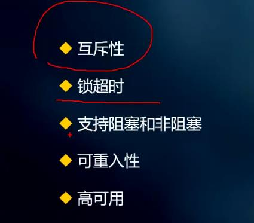

## 常用的分布式锁 
### 基于Redis、数据库、zookeeper 来实现

## 基于redis

``` java
redisTemplate.opsForValue.setIfAbsent(k,v) 返回一个boolean
```
这种方式会产生死锁
例如：如果出现异常后面代码没有执行，没有delete就会死锁，try catch finally 貌似可以解决，但是宕机情况也会死锁
所以使用超时时间过期的方式

需要实现一个阻塞锁，尝试一直去拿锁，自旋锁
不可重入，及多次拿到锁之后，会得到false
解决方案是 计数的方式，加锁+1，解锁-1，当值为0的时候再delete
过期时间不足以执行完代码也会释放锁，导致锁失效，注意设置好过期时间
可以采取 异步的设置过期时间 异步续命的方式
## 一个分布式锁，满足以下需求

### redisson框架可解决分布式锁

## CAP理论
C一致性 A可用性 P分区容错性
### redis 和 zookeeper 区别
P必须满足 CA满足一个
reids 满足AP
zookeeper 满足CP
redis存在主从同步的时候失效得话 也会产生锁失效
zk更能满足 redis 容易出现以上情况 


